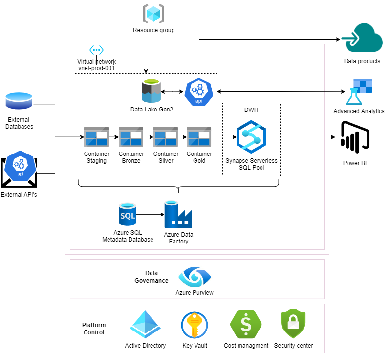

# 1
The system implemented is the ETL module in this repo. The classes are then used in the 'download_stackexchange_archives.ipynb' notebook to provide an answer to question 1. In the code, as well as in the notebook you can find comments to explain the implementation.

# 2 
The SQL scripts containing the answers to question 2 are in the sqlscripts folder.

# 3
\
\
Here is an example diagram of such a system.

## Scheduling
This is just an example of a system which could handle a volume of data and an azure architecture. The most important giveaway is that you do not only need an ETL tool which can Extract, Transform and Load data but you also need a scheduling tool. In this case the scheduling is handled by Azure Data Factory but there are many more tools available which can do this, for example AWS Glue. 
## Uniformity
Also an important element of such a system is uniformity. You need a uniform way to load, transform and extract the data and to schedule it. A possible way to implement this is by using a standardized metadata database to control your system. This is also present in the dagram in the form of an Azure SQL Metadata Database.
## Detailed description of the system
The system contains a number of steps:
1. First you extract the data from the archive.org or any other source into the staging folder
2. After extracting you need to make sure all of the data is in the same format (or at least as much as possible), then the data is in the bronze container.
3. Then you can additional transformations to the data after which the data is in the silver folder.
4. Lastly the data is inserted into the gold container. The SQL database in this case is a serverless database so you just create a view on the gold container to be able to do your analysis or to load the data into a BI tool.

# 4
To ensure good data governance over such an amount of data a number of things are important. Firstly you need to make sure that your systems are geo-redundant, which means that when there are fallouts in any region that the system is still intact. Furthermore you need some kind of tool that makes sure the data integrity is intact throughout all of ticketswap's systems. It is easy to just look at the results of analysis of the data or sales but to make sure the data is governed well the need for a system which performs analysis within the system is essential. These are examples of a more top down approach to data governance. From a bottem up perspective I think one of the most important things to ensure is that you implement a simple and effective system. This has to be a system where you have a good overview of all processes and which does not get cluttered. To ensure this you need to use the right tools and orchestration method. Within this system I think version control is also important. Not only for the system itself but also for the data contained inside (for example https://lakefs.io/). \
For the event instrumentation you could use any tool which uses a metadata system to log events and to make it easy to search and filter events. A possible example of such a system would be https://openlineage.io/.